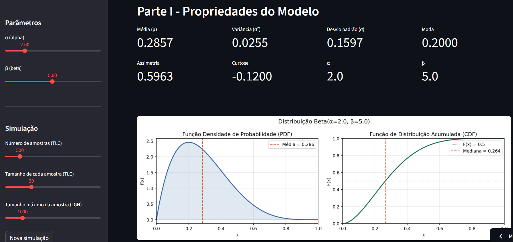
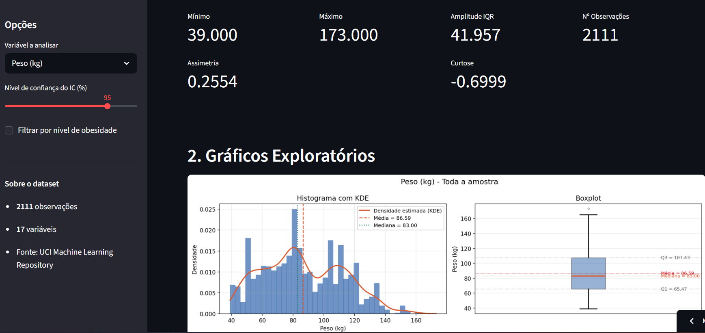

# 📊 Interactive Statistics Apps

A collection of interactive statistical applications developed in Python with Streamlit for the **Statistics Labs II** course at the University of Minho.

This project combines theoretical probability concepts with practical exploratory data analysis through two web applications:

- 📈 **Beta Distribution Explorer**
- 🧬 **Obesity Dataset Exploratory Analysis**

> University project focused on probability distributions, statistical simulations, exploratory data analysis, confidence intervals, and interactive data visualization.

---

## 🚀 Applications

### 📈 Beta Distribution Explorer

Interactive application for exploring the properties of the Beta distribution.

#### Features

- Dynamic Beta PDF and CDF visualization
- Real-time parameter adjustment with sliders
- Statistical properties calculation:
  - Mean
  - Variance
  - Standard deviation
  - Mode
- Law of Large Numbers simulation
- Central Limit Theorem simulation
- Interactive graphical visualizations

---

### 🧬 Obesity Dataset Exploratory Analysis

Interactive exploratory analysis tool based on the **Obesity Levels Dataset** from the UCI Machine Learning Repository.

#### Features

- Descriptive statistics computation
- Histograms with KDE estimation
- Boxplots and comparative visualizations
- Confidence intervals for population means
- Group comparison by obesity level
- Interactive filtering and variable selection

Dataset includes:
- 2111 observations
- 17 variables
- Data from Mexico, Peru, and Colombia

---

## 🌐 Live Applications

- Beta Distribution App:  
  `https://your-beta-app.streamlit.app`

- Obesity Analysis App:  
  `https://your-obesity-app.streamlit.app`

---

## 📸 Preview

### Beta Distribution App



### Obesity Analysis App



---

## 🛠 Technologies Used

- Python
- Streamlit
- NumPy
- SciPy
- Matplotlib
- Pandas

---

## 📦 Installation

Clone the repository:

```bash
git clone https://github.com/EdgarReaper/interactive-statistics-apps.git
cd interactive-statistics-apps
pip install -r requirements.txt
streamlit run beta-app.py
streamlit run obesity-app.py
